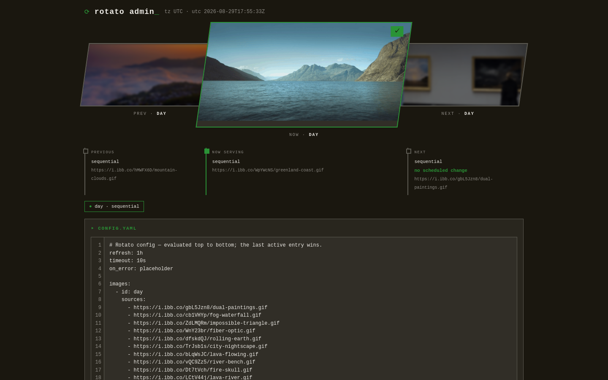
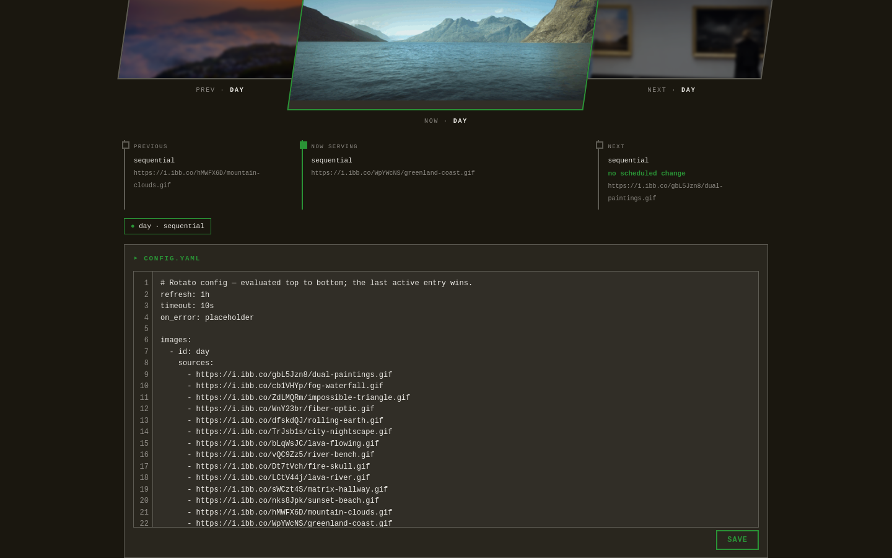

<p align="center">
  
</p>

# Rotato

A tiny Go service that serves a **single rotating image** at `GET /image` for
homelab dashboards such as [Homepage](https://gethomepage.dev/), Dashy, Heimdall, and
friends. You configure a few images (local files or remote URLs) in a YAML
file; Rotato picks the right one for the current moment based on per-entry
rotation rules, and serves it with the correct `Content-Type`.

<p align="center">
  
  
  <br>
  <em>The admin UI: what's served now and next, plus the raw YAML editor.</em>
</p>

- **Tiny**: single static binary, Docker image built from `scratch` (~7 MB).
- **Zero external state**: no database, no auth, no logging framework; one
  YAML file and the image files are all it needs.
- **Admin UI**: a built-in terminal-styled page (`/admin`) to edit the config
  live and see what will be served next. The terminal look is a slight
  modification of [terminal.css](https://github.com/panr/terminal-css/).

## Contents

- [Quick start](#quick-start)
- [How it works](#how-it-works)
- [Configuration](#configuration)
  - [Global options](#global-options)
  - [Image entries](#image-entries)
  - [Rotation types](#rotation-types)
  - [Formats](#formats)
  - [Example config](#example-config)
- [Running it](#running-it)
  - [Docker Compose (recommended)](#docker-compose-recommended)
  - [Plain Docker](#plain-docker)
  - [Local Go build](#local-go-build)
- [Building for another architecture (Raspberry Pi)](#building-for-another-architecture-raspberry-pi)
- [HTTP API](#http-api)
- [Dashboard widgets](#dashboard-widgets)
- [Environment variables](#environment-variables)
- [Troubleshooting](#troubleshooting)

---

## Quick start

```bash
mkdir -p config data
docker compose up -d
```

That's it: a sample `config.yaml` is auto-created in `./config` on first
start. Point your dashboard at `http://<host>:8080/image`, or open the admin
UI at `http://<host>:8080/admin` to edit the config.

> The compose file runs the container as `PUID:PGID` (default `1000:1000`).
> Create `config/` and `data/` owned by that user first, or the seed write
> and admin-UI saves will fail.

## How it works

- Every request evaluates the `images:` list **top to bottom**; the **last
  active entry wins**. File order is the only priority: later entries override
  earlier ones.
- Each entry has up to three orthogonal concerns:
  - **which** source is shown → the rotation type (`static`, `interval`,
    `daily`, `sequential`),
  - **when** it is active → the `daily` time window / date gate,
  - **how fresh** the bytes are → `refresh` (remote sources only).
- The container clock is UTC, but `at`/`until`/`dates` are interpreted in the
  timezone set by `tz:` (default: the `TZ` env var, else UTC). Interval cycles
  are epoch-aligned and timezone-independent.
- Remote sources are cached in memory and re-fetched on the `refresh` cadence;
  a failed refresh keeps serving the stale bytes. If no entry is active at all,
  `/image` returns `404`.

## Configuration

The config file is strict YAML: **unknown keys are rejected** (a typo like
`everyday:` fails validation instead of silently behaving like `static`), and
every structural mistake produces a clear error, surfaced by `POST
/api/config`, the admin UI, and `/api/status` (`last_error`).

### Global options

```yaml
refresh: 1h            # default re-fetch cadence for remote sources.
                       #   `never` (or 0) = fetch once, cache forever.
                       #   Default: 1h.
timeout: 10s           # per-fetch HTTP timeout. Default: 10s.
on_error: placeholder  # global default for entries that don't override:
                       #   placeholder | skip. Default: placeholder.
placeholder: ph.jpg    # optional error placeholder (local path or http(s)
                       #   URL) served when the winning entry's source cannot
                       #   be fetched and on_error is "placeholder". Falls
                       #   back to a built-in 1x1 transparent GIF when unset
                       #   or unloadable. Default: unset.
tz: Europe/Berlin      # IANA timezone for at/until/dates. Default: the TZ
                       #   environment variable if set, else UTC.
theme:                 # optional admin-UI theme (YAML-only, not editable
                       #   in the UI).
  mode: auto           # auto | dark | light; "auto" follows the browser.
  dark:
    background: "#1a170f"
    foreground: "#eceae5"
    accent: "#2a9336"
  light:
    background: "#f5f3ee"
    foreground: "#1f1d17"
    accent: "#1f7a2e"
```

### Image entries

```yaml
images:
  - id: evening              # required, unique (used by ?id= and the admin UI)
    sources:                 # required. A single path/URL may also be written
      - sunsets/a.jpg        #   as a scalar:  sources: sunsets/a.jpg
      - sunsets/b.jpg

    rotation:                # optional; omitted = static
      type: daily            # static | interval | daily | sequential
      every: 30m             # interval: how long each source is shown (required)
                             # daily:    optional; cycle sources while the
                             #           window is active (needs >= 2 sources)
      at: "18:00"            # daily: window start, HH:MM (required)
      until: "06:00"         # daily: window end, optional (default: midnight)
      dates: ["25-12"]       # daily: optional calendar dates (DD-MM) the entry
                             #   is limited to; combines with the time window

    refresh: 15m             # optional per-entry override of global `refresh`
                             #   (remote sources only)
    on_error: skip           # optional per-entry override of global `on_error`
```

**`sources`** is a local path or remote `http(s)://` URL, scalar or list. Local
paths are resolved against the **data root** (`DATA_ROOT`, default
`/app/data`): `img.jpg` → `/app/data/img.jpg`; a leading slash does not make
the path container-absolute (`/path/img.jpg` → `/app/data/path/img.jpg`).

### Rotation types

| Type | Sources | Behavior |
|---|---|---|
| `static` | 1 | Always active, never changes; the base layer. Also the implicit default when `rotation` is omitted. |
| `interval` + `every` | ≥2 | Always active; cycles the list, each source shown for `every`. Epoch-aligned (`index = unix / every % len`) → deterministic across restarts, no state to store. |
| `sequential` | ≥2 | Always active; advances **one step per GET request**: first hit serves `sources[0]`, the next `sources[1]`, … wrapping around. In-memory cursor (reset on restart). HEAD and `?id=` previews do not advance. |
| `daily` + `at` | 1 | Active from `at` until midnight (in `tz`). Place it *after* the always-active entries it should shadow. |
| `daily` + `at` + `until` | 1 | Active within `[at, until)`. If `until <= at` the window **wraps past midnight** (`at: "22:00", until: "06:00"` = evening + night). |
| `daily` + `dates` | ≥1 | Active only on the listed `DD-MM` calendar days (in `tz`). Combines with the time window; both must match. `at: "00:00"` = all day. |
| `daily` + `every` | ≥2 | Composition: while the daily window is active, also cycle the sources every `every`. |

**`on_error`** decides what happens when the winning entry's source can't be
fetched: `skip` treats the entry as inactive for this request (the next
earlier active entry is served instead); `placeholder` serves the placeholder.
Supported image formats: PNG, JPEG, GIF, WebP.

### Formats

- **Times**: `"HH:MM"`, 24-hour, interpreted in the configured `tz`.
- **Dates**: `"DD-MM"` (day-month), recurring every year, e.g. `"25-12"`.
- **Durations** (`every`, `refresh`, `timeout`): Go duration strings
  (`"30m"`, `"6h"`, `"3600s"`, `"24h"`) or a plain integer = seconds.
  `never` is accepted for `refresh` (= cache forever).

### Example config

```yaml
refresh: 1h
timeout: 10s
on_error: placeholder
tz: Europe/Berlin

images:
  # base layer; always active unless overridden below
  - id: day
    sources: day.jpg

  # remote camera snapshot: re-fetched hourly; if it's down, "day" shows instead
  - id: backyard-cam
    sources: http://camera.lan/snapshot.jpg
    refresh: 1h
    on_error: skip

  # from 18:00 to midnight this overrides the entries above,
  # cycling two sunsets every 30 min while active
  - id: evening
    sources:
      - sunsets/a.jpg
      - sunsets/b.jpg
    rotation:
      type: daily
      at: "18:00"
      every: 30m

  # wraps midnight: active 22:00–24:00 and 00:00–06:00
  - id: night
    sources: night.jpg
    rotation:
      type: daily
      at: "22:00"
      until: "06:00"

  # sequential: advance one image per request
  - id: cycle
    sources:
      - a.gif
      - b.gif
      - c.gif
    rotation:
      type: sequential
```

## Running it

### Docker Compose (recommended)

```bash
mkdir -p config data && chown ${PUID:-1000}:${PGID:-1000} config data
docker compose up -d
```

- `./config` is mounted at `/app/config` (config + admin-UI saves),
  `./data` at `/app/data` (image files).
- Both are **directory** mounts on purpose: a single-file bind mount breaks
  the atomic-rename save that `POST /api/config` uses.
- The sample config is auto-seeded into `./config` on first start if missing.

### Plain Docker

```bash
docker build -t rotato .
docker run -p 8080:8080 \
  -v $(pwd)/config:/app/config \
  -v $(pwd)/data:/app/data \
  rotato
```

### Local Go build

Requires Go 1.27+.

```bash
go build -o rotato .
CONFIG_PATH=./config.yaml DATA_ROOT=./data ./rotato
```

## Building for another architecture (Raspberry Pi)

The build is parameterized by **`TARGETARCH`** (BuildKit's automatic platform
arg, passed through by docker compose). Empty/unset = the build host's native
arch, so every command above "just works" anywhere. To cross-build an **arm64**
image for a Raspberry Pi, even when building on an x86 machine, since Go
cross-compiles natively with `CGO_ENABLED=0` (no QEMU/binfmt needed):

```bash
TARGETARCH=arm64 docker compose build
```

Then move the image to the Pi. With a tarball (about 3 MB gzipped):

```bash
# on the build machine
docker save rotato:latest | gzip > rotato-arm64.tar.gz

# copy the tarball over, then on the Pi:
gunzip -c rotato-arm64.tar.gz | docker load
docker compose up -d
```

Or push/pull via a registry:

```bash
TARGETARCH=arm64 docker compose build
docker tag rotato:latest your-registry/rotato:arm64
docker push your-registry/rotato:arm64   # then pull on the Pi
```

### Deploying on the Pi

The Pi only runs the image you built: copy `docker-compose.yml` and drop the
`build:` block (or use the minimal one below). Adjust the host port on the
left of the `ports:` mapping to fit your LAN.

```yaml
services:
  rotato:
    image: rotato:latest
    container_name: rotato
    restart: unless-stopped
    ports:
      - "8080:8080"   # left side: the host port you expose
    user: "${PUID:-1000}:${PGID:-1000}"
    environment:
      PUID: ${PUID:-1000}
      PGID: ${PGID:-1000}
      TZ: ${TZ:-UTC}
    volumes:
      - ./config:/app/config
      - ./data:/app/data
```

Findings from a real Pi deployment:

- The image **manifest** carries the build host's architecture, while the
  **binary inside** is the cross-compiled target. Docker prints a warning when
  they differ, but the image runs fine. Do **not** add `platform:
  linux/arm64` to the compose file: that makes Docker look for a matching
  manifest in a registry instead of using the local image.
- `config/` and `data/` must be writable by the container user (`PUID:PGID`,
  default `1000:1000`), otherwise the config auto-seed and admin-UI saves fail.
- Updating after a rebuild is the same save/load dance:

```bash
# on the build machine
TARGETARCH=arm64 docker compose build
docker save rotato:latest | gzip > rotato-arm64.tar.gz

# copy the tarball over, then on the Pi:
gunzip -c rotato-arm64.tar.gz | docker load
docker compose up -d --force-recreate
```

## HTTP API

| Endpoint | Method | Description |
|---|---|---|
| `/image` | GET | Currently active image (raw bytes, correct `Content-Type`). `?id=<id>` bypasses the time gate and serves that entry's current source (no advance for `sequential`). |
| `/image` | HEAD | Headers only (same as GET). |
| `/admin` | GET | The admin UI. |
| `/favicon.svg` | GET | The app favicon as SVG (the admin UI's icon). Use it for Homepage's `favicon:` / app icons. |
| `/api/config` | GET | The current `config.yaml` content (plain text). |
| `/api/config` | POST | Validates the body, writes it atomically, triggers a reload. `400` + the exact error when invalid. Body capped at 1 MB. |
| `/api/config/validate` | POST | Dry-run: parses and validates without writing. Powers the admin UI's live validity indicator. |
| `/api/preview?src=` | GET | Raw bytes of one source (path or URL) from the preview cache; used by the admin UI's carousel. |
| `/api/status` | GET | JSON: `utc_now`, `timezone`, `active_entry_id`, `active_source`, `config_path`, `config_mtime`, `last_error`, `cache_entries`, `theme`, and `timeline` (prev/current/next slots + `next_change`). The "why is my dashboard showing the wrong picture" debugging aid. |
| `/health` | GET | `200 OK`. |

`/image` response headers: `Content-Type`, `ETag` (hash of the bytes),
`X-Image-ID` (winning entry id), `Cache-Control: no-cache` (rotation may change
any second; the ETag keeps transfers down to 304s).

## Dashboard widgets

Point any dashboard widget at the image URL: the response is a plain image
with correct headers, and `?id=` lets you pin a specific entry:

```
http://<host>:8080/image            # whatever is active right now
http://<host>:8080/image?id=night   # always the "night" entry's source
```

For example in Homepage's `customapi` widget or a plain ``/`!image` block,
use `http://<host>:8080/image` as the image source. Use `?id=` for widgets that
should always show a specific rotation regardless of time of day.

For Homepage's `favicon:` setting (or any app-icon slot), point it at the
dedicated endpoint:

```yaml
favicon: http://<host>:8080/favicon.svg
```

## Environment variables

| Variable | Default | Purpose |
|---|---|---|
| `TARGETARCH` | build host arch | Go target architecture for the Docker build (`arm64` for Raspberry Pi). |
| `CONFIG_PATH` | `/app/config/config.yaml` | Config file location (local runs). |
| `DATA_ROOT` | `/app/data` | Base directory for local `sources:` paths. |
| `TZ` | unset (→ UTC) | Timezone for `at`/`until`/`dates` when the config has no `tz:`. |
| `PUID` / `PGID` | `1000` / `1000` | Host user/group the container runs as (compose only). |

## Troubleshooting

- **`/image` returns 404**: no entry is active right now. Check `/api/status`:
  `active_entry_id` is empty. Add an always-active `static` base layer.
- **Wrong image showing?** Check `/api/status`: it shows the active entry, its source,
  and the full `timeline` (what was served, what's next, and when the next
  change happens). Remember: the **last** active entry wins; later entries
  override earlier ones.
- **Times are off by hours**: set `tz:` (or the `TZ` env var). `at`/`until`/
  `dates` are wall-clock gates in the configured timezone, not UTC.
- **Remote image keeps failing**: check `/api/status` → `last_error`, and the
  entry's `on_error` policy (`skip` falls back to an earlier entry;
  `placeholder` shows the placeholder). A failed refresh keeps serving the last
  good bytes; failures are retried after a 30 s cooldown.
- **Admin UI won't save**: the container writes `config.yaml` as `PUID:PGID`;
  make sure `./config` is owned by that user (`chown`).
